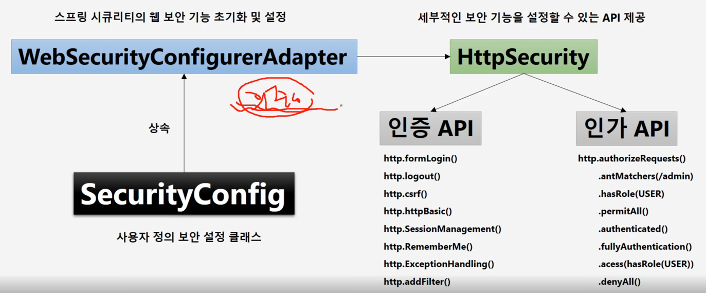
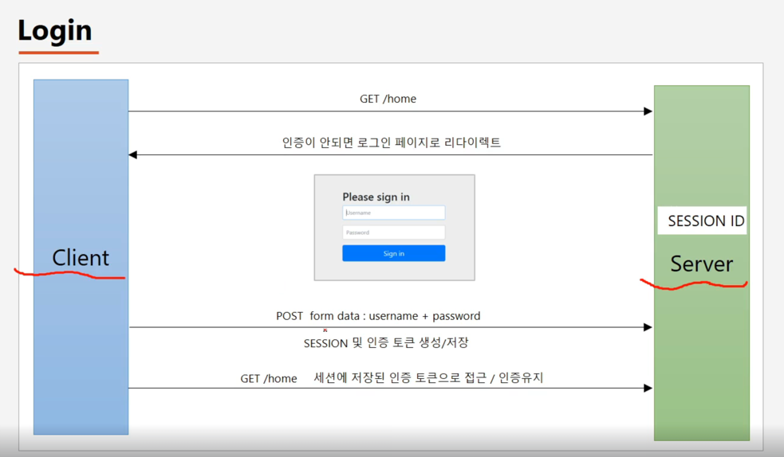
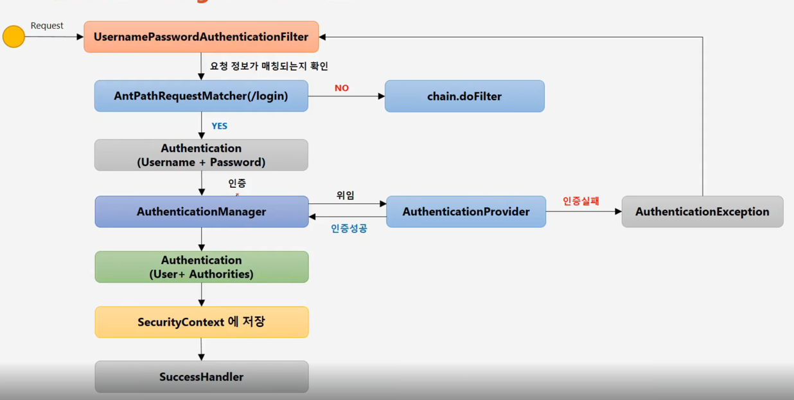
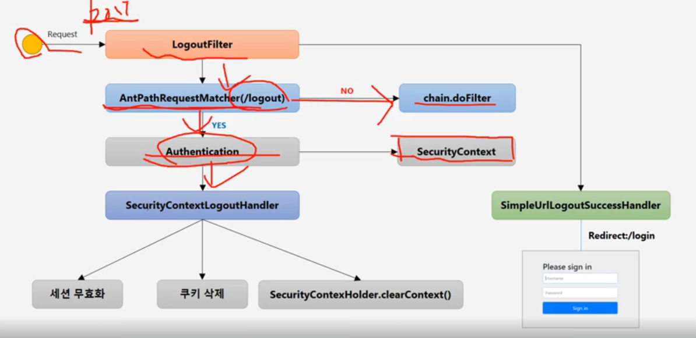

# 스프링 시큐리티 기본 API & Filter 이해

## 01. 인증 API - 스프링 시큐리티 의존성 추가 
### 스프링 시큐리티 의존성 추가 시 일어나는 일들
- 시큐리티 초기화 작업 및 보안 설정 
- 1. 모든 요청은 인증되어야 자원에 접근 가능
- 2. 인증 방식은 폼 로그인 방식과 httpBasic 로그인 방식을 제공함. 
- 3. 기본 로그인 페이지 제공
- 4. 기본 계정 한 개 제공 - username: user / password : 랜덤문자열

## 02. 인증 API -  사용자 정의 보안 기능 구현 

- SecurityConfig -상속-> WebSecurityConfigurerAdapter -> HttpSecurity -> 인증 & 인가 API
### SecurityConfig
- SecurityConfig: (사용자 정의)보안 설정 클래스
### WebSecurityConfigurerAdapter
- WebSecurityConfigurerAdapter: 시큐리티 웹보안 기능을 초기화하고 설정을 하는 클래스
### HttpSecurity
- HttpSecurity: WebSecurityConfigurerAdapter에 의해서 생성됨. 
- -> 세부적인 보안 기능을 설정할 수 있는 API를 제공
```java
@Configuration
@EnableWebSecurity // WebSecurityConfiguration 등의 클래스 추가
public class SecurityConfig extends WebSecurityConfigurerAdapter {
    @Override
    protected void configure(HttpSecurity http) throws Exception { //템플릿-콜백..?
        http // 인가
                .authorizeRequests() // 요청에 대한 보안 검사 시작됨
                .anyRequest().authenticated(); // 모든 요청에 대해 인증 받기
        http // 인증
                .formLogin(); //폼 로그린  
    }
}
```
```yml
# 패스워드 고정 설정
spring:
  security:
    user:
      name: user
      password: 1111
```

## 04. 인증 API - Form 인증
### 내부 처리 순서

- 1. 클라이언트에서 요청 보냄
- 2. 요청에 인증이 안되면 로그인 페이지로 서버가 리다이렉트 시킴
- 3. 클라이언트에서 인증 요청 -> 서버에서 세션 및 인증 토큰 생성/저장 
- -> 서버에서 시큐리티가 세션을 생성, 인증객체(Authentication)및토큰 생성, 시큐리티 컨텍스트에 인증객체 저장, 시큐리티 컨텍스트 세션에 저장.   
- 4. 클라이언트에서 세션에 저장된 인증 토큰으로 접근 / 인증 유지 

### API 기능 - http.formLogin()  
- http.formLogin() -> form 로그인 인증 기능이 작동함  
```java
 protected void configure(HttpSecurity http) throws Exception {
    http.formLogin()
            .loginPage("/login.html") // 사용자 정의 로그인 페이지
            .defaultSuccessUrl("/home") // 로그인 성공 후 이동 페이지
            .failureUrl("/login.html?error=true") // 로그인 실패 후 이동 페이지
            .usernameParameter("username") // 아이디 파라미터명 설정
            .passwordParameter("password") // 패스워드 파라미터명 설정
            .loginProcessingUrl("/login") // 로그인 Form Action Url
            .successHandler(loginSuccessHandler()) // 로그인 성공 후 핸들러
            .failureHandler(loginFailureHandler()); // 로그인 실패 후 핸들러
}
```
```java
// 예시
@Override
protected void configure(HttpSecurity http) throws Exception { //템플릿-콜백..?
    http // 인가
            .authorizeRequests() // 요청에 대한 보안 검사 시작됨
            .anyRequest().authenticated(); // 모든 요청에 대해 인증 받기
    http // 인증
            .formLogin() //폼 로그린
            .loginPage("/loginPage")
            .defaultSuccessUrl("/")
            .failureUrl("/login")
            .usernameParameter("userId") //프론트와 맞춰야함
            .passwordParameter("passwd") //프론트와 맞춰야함
            .loginProcessingUrl("/login_proc") //프론트와 맞춰야함
            // AuthenticationSuccessHandler 구현체 콜백
            .successHandler(new AuthenticationSuccessHandler() {
                @Override
                public void onAuthenticationSuccess(HttpServletRequest request, HttpServletResponse response, Authentication authentication) throws IOException, ServletException {
                    System.out.println("authentication " + authentication.getName());
                    response.sendRedirect("/");
                }
            })
            // AuthenticationFailureHandler 구현체 콜백
            .failureHandler(new AuthenticationFailureHandler() {
                @Override
                public void onAuthenticationFailure(HttpServletRequest request, HttpServletResponse response, AuthenticationException exception) throws IOException, ServletException {
                    System.out.println("exception " + exception.getMessage());
                    response.sendRedirect("/login");
                }
            })
            .permitAll(); // "/loginPage"에 접근하는 사용자는 모두 허용
}
```

## 05. 인증 API - UsernamePasswordAuthenticationFilter

### UsernamePasswordAuthenticationFilter
- 인증처리를 담당하고 인증처리 관련 요청을 처리하는 필터
### 작동과정
- Request(post) -> UsernamePasswordAuthenticationFilter
- UsernamePasswordAuthenticationFilter에서 요청정보가 매칭 되는지 확인
- 호출 -> AntPathRequestMatcher() -> 실패시 -> chain.doFilter
- 성공시 -> 인증객체 Authentication(username+password) 획득
- 인증을 인증관리자에게 전달 - AuthenticationManager 
- 위임 -> AuthenticationProvider - 실제인증처리를 담당하는 객체 
- 인증 실패 시 -> AuthenticationException -> UsernamePasswordAuthenticationFilter
- 인증 성공 시 -> AuthenticationProvider가 Authentication 객체 생성(유저,권한정보 담아서)
- -> 생성된 Authentication객체를 AuthenticationManager에 전달 
- AuthenticationManager는 받은 Authentication을 객체를 다시 필터로 전달
- -> 필터는 Authentication을 SecurityContext에 저장함 (나중에 SecurityContext는 세션에 저장됨)
- -> SuccessHandler

#### cf) FilterChainProxy
- 사용자 요청을 제일 먼저 받고 스프링 기본생성 및 사용자 설정 필터들을 순서대로 사용자가 사용할 수 있도록 호출해줌.

## 06. 인증 API - Logout, LogoutFilter
- 로그아웃 api는 기본적으로 post 요청으로 가능 
- -> 세션 무효화, 인증토큰삭제(인증토큰저장되어있는객체도 삭제), 쿠기정보삭제, 로그인 페이지로 리다이렉트
```java
@Override
protected void configure(HttpSecurity http) throws Exception {
    http.logout() // 로그아웃처리
            .logoutUrl("/logout") // 로그아웃처리 url  
            .logoutSuccessUrl("/login") // 로그아웃 성공 후 이동페이지
            .deleteCookies("JSESSIONID", "remember-me") // 로그아웃 후 쿠키 삭
            .addLogoutHandler(new LogoutHandler() { // 세션 무효화 예시
                @Override
                public void logout(HttpServletRequest request, HttpServletResponse response, Authentication authentication) {
                    HttpSession session = request.getSession();
                    session.invalidate();
                }
            }) 
            .logoutSuccessHandler(new LogoutSuccessHandler() { //로그아웃 성공 후 핸들러//리다이렉트예시
                @Override
                public void onLogoutSuccess(HttpServletRequest request, HttpServletResponse response, Authentication authentication) throws IOException, ServletException {
                    response.sendRedirect("/login");
                }
            }); 
}
```
### Logout Filter

- Request -> UsernamePasswordAuthenticationFilter
- -> AntPathRequestMatcher -> 실패시 -> chain.doFilter
- -> SecurityContext에서 -> Authentication 가져옴
- -> SecurityLogoutHandler에 인증객체 전달 -> 세션 무효화, 쿠키 삭제, SecurityContextHolder.clearContext()
- -> 최종까지 성공하면 Logout Filter는 SimpleUrlLogoutSuccessHandler를 호출하여 로그아웃 이후 작업 처리  

